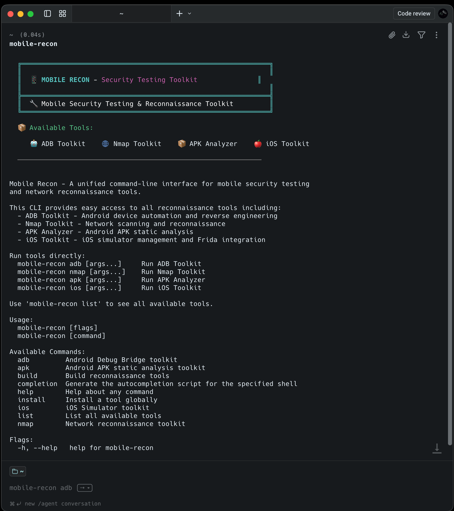
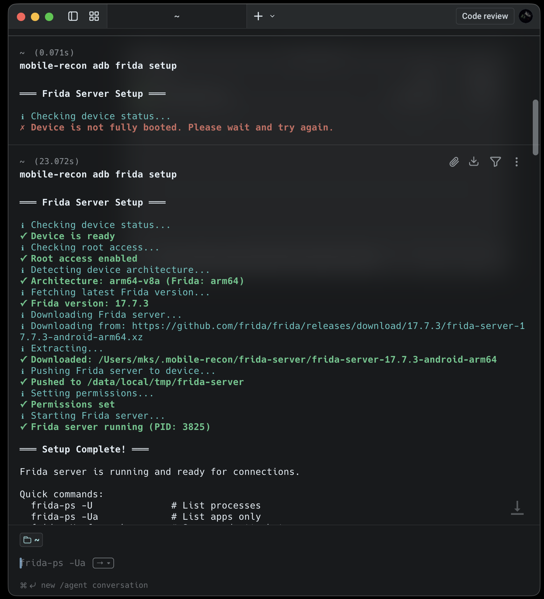

# Mobile Recon Toolkit


A unified CLI toolkit for mobile security testing — Android, iOS, and the networks they run on.

> **Educational project** built for learning mobile security concepts and experimenting in lab environments. Still in active development — use in controlled environments only.
> Built with [Claude](https://claude.ai) as an AI-assisted development experiment.

---



*Unified CLI — all tools in one place*



*One-command Frida server setup on Android*

---

## Tools

### ADB Toolkit
Android device automation over ADB. Manage devices, extract APKs, monitor logs, and automate input. The standout feature is **one-command Frida server setup** — detects device architecture, downloads the correct Frida version, pushes it, and starts the server automatically.

```bash
mobile-recon adb device list              # list connected devices
mobile-recon adb app pull <package>       # extract APK from device
mobile-recon adb recon logcat             # stream device logs
mobile-recon adb frida setup              # auto-install & start Frida server
mobile-recon adb frida ps                 # list running processes
```

### Nmap Toolkit
Local network discovery focused on mobile environments. Quickly find all devices on a network, detect open services, test SSL/TLS, and specifically locate Android ADB devices or identify MITM proxies like Burp and Charles.

```bash
mobile-recon nmap scan quick <network/24>     # discover live hosts
mobile-recon nmap detect service <target>     # identify running services
mobile-recon nmap mobile adb <network/24>     # find Android devices with ADB open
mobile-recon nmap mobile mitm <network/24>    # detect Burp/Charles/mitmproxy
mobile-recon nmap ssl scan <target>           # test SSL/TLS configuration
```

### APK Analyzer
Static analysis for Android APKs — no installation required. Parse the manifest, audit permissions, run security checks, and extract strings or URLs directly from the binary.

```bash
mobile-recon apk info app.apk                 # metadata and basic info
mobile-recon apk permissions app.apk          # list all permissions
mobile-recon apk security app.apk             # security audit in one command
mobile-recon apk strings --urls app.apk       # extract URLs from the APK
```

### iOS Toolkit
iOS Simulator management with Frida integration — boot simulators, list running processes, attach to apps, or spawn and instrument them, all without opening Xcode.

```bash
mobile-recon ios device list                  # list available simulators
mobile-recon ios device boot <udid>           # boot a simulator
mobile-recon ios frida setup                  # install Frida
mobile-recon ios frida attach <pid>           # attach to a running process
mobile-recon ios frida spawn <bundle-id>      # spawn and instrument an app
```

---

## Getting Started

### Requirements

| Dependency | Required For | Install |
|------------|-------------|---------|
| Go 1.21+ | Building | [golang.org/dl](https://golang.org/dl/) |
| ADB | ADB Toolkit | `brew install android-platform-tools` |
| Nmap | Nmap Toolkit | `brew install nmap` |
| Xcode | iOS Toolkit | Mac App Store |

### Install

```bash
git clone https://github.com/MKS-01/mobile-recon.git
cd mobile-recon
./scripts/install.sh
```

The install script builds the binary and places it in `~/go/bin`. If `mobile-recon` is not found, add Go's bin to your PATH:

```bash
export PATH="$HOME/go/bin:$PATH"  # add to ~/.zshrc or ~/.bashrc
```

---

## Contributing

1. Fork and create a branch: `git checkout -b feature/your-feature`
2. Make changes and verify the build: `go build ./...`
3. Rebuild and install: `./scripts/install.sh`
4. Open a Pull Request with a clear description

Follow the existing tool structure in `go-tools/` when adding new toolkits.

---

## Disclaimer

This project is **educational and experimental**. It has not been fully tested and is not production-ready. Always obtain proper authorization before scanning networks or testing apps you don't own.

**Use responsibly. The author is not liable for any misuse.**

## License

MIT — see [LICENSE](LICENSE).
