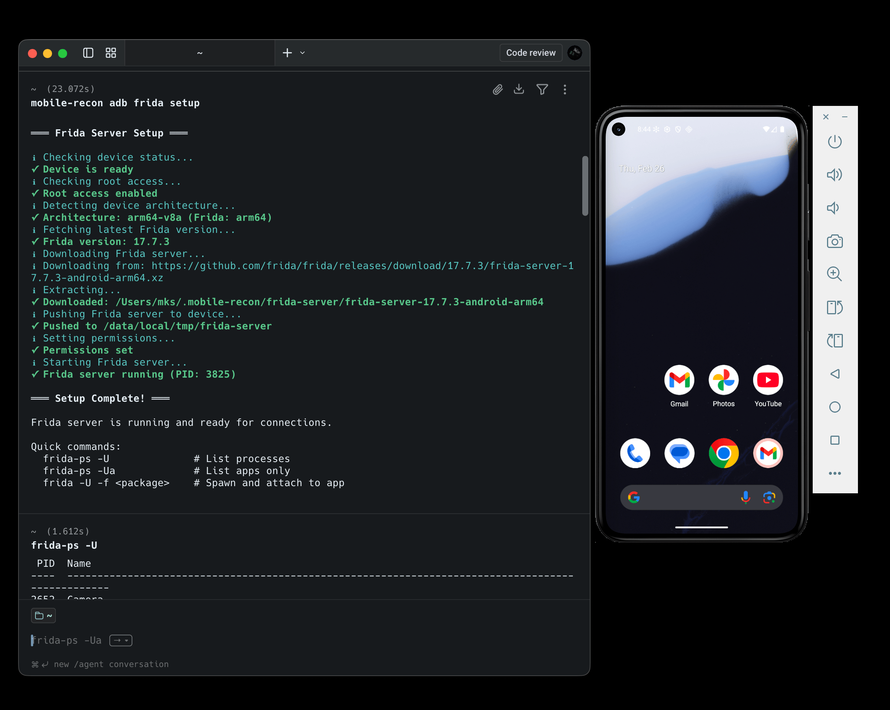

# Mobile Recon Toolkit


A unified CLI toolkit for mobile security testing — Android, iOS, and the networks they run on.

> **Educational project.** Built for learning mobile security concepts, understanding tooling, and experimenting in lab environments. Still in active development and requires thorough testing before use in any real scenario.

> Built with [Claude](https://claude.ai) as an AI-assisted development experiment.

## Preview




## Tools

### ADB Toolkit
Android device automation and reverse engineering over ADB. Manage devices, pull APKs, monitor logs, and automate input. Includes **one-command Frida server setup** — automatically detects architecture, downloads the right Frida version, pushes it to the device, and starts it.

```bash
mobile-recon adb frida setup   # auto-installs & starts Frida server on device
mobile-recon adb frida ps      # list running processes
```

### Nmap Toolkit
Local network discovery focused on mobile environments. Find devices on your network, detect services, test SSL/TLS, and locate Android/iOS devices by scanning for ADB and lockdown ports.

```bash
mobile-recon nmap mobile adb <network>   # find Android devices with ADB open
mobile-recon nmap mobile mitm <network>  # detect Burp/Charles/mitmproxy proxies
```

### APK Analyzer
Static analysis for Android APKs without needing to install them. Extracts metadata, parses the manifest, flags dangerous permissions, and pulls URLs and secrets from strings.

```bash
mobile-recon apk security app.apk        # security checks in one command
mobile-recon apk strings --urls app.apk  # extract all URLs from the APK
```

### iOS Toolkit
iOS Simulator management with Frida integration. Boot simulators, list running apps, attach to processes, or spawn apps with Frida — all from the CLI without opening Xcode.

```bash
mobile-recon ios frida setup             # install Frida on simulator
mobile-recon ios frida spawn <bundle-id> # spawn and instrument an app
```

## Requirements

| Dependency | Required For | Install |
|------------|-------------|---------|
| Go 1.21+ | Building | [golang.org/dl](https://golang.org/dl/) |
| ADB | ADB Toolkit | `brew install android-platform-tools` |
| Nmap | Nmap Toolkit | `brew install nmap` |
| Xcode | iOS Toolkit | Mac App Store |

## Installation

```bash
git clone https://github.com/MKS-01/mobile-recon.git
cd mobile-recon
./scripts/install.sh
```

The install script builds the binary and installs it to `~/go/bin`. If `mobile-recon` is not found after install, ensure Go's bin is in your PATH:

```bash
export PATH="$HOME/go/bin:$PATH"  # add to ~/.zshrc or ~/.bashrc
```

## Usage

```
mobile-recon <tool> <command> [flags]
```

### ADB Toolkit

```bash
mobile-recon adb device list
mobile-recon adb device info
mobile-recon adb app list
mobile-recon adb app pull <package>
mobile-recon adb recon logcat
mobile-recon adb frida setup
mobile-recon adb frida ps
```

### Nmap Toolkit

```bash
mobile-recon nmap scan quick <network/24>
mobile-recon nmap scan port <target>
mobile-recon nmap detect service <target>
mobile-recon nmap ssl scan <target>
mobile-recon nmap mobile adb <network/24>
mobile-recon nmap mobile ios <network/24>
mobile-recon nmap mobile mitm <network/24>
```

### APK Analyzer

```bash
mobile-recon apk info app.apk
mobile-recon apk manifest app.apk
mobile-recon apk permissions app.apk
mobile-recon apk security app.apk
mobile-recon apk strings --urls app.apk
```

### iOS Toolkit

```bash
mobile-recon ios device list
mobile-recon ios device boot <udid>
mobile-recon ios frida ps
mobile-recon ios frida attach <pid>
mobile-recon ios frida spawn <bundle-id>
```

## Contributing

1. Fork and create a branch: `git checkout -b feature/your-feature`
2. Make changes and verify: `go build ./...`
3. Rebuild: `cd go-tools/mobile-recon-cli && go build -o mobile-recon && mv mobile-recon ~/go/bin/`
4. Open a Pull Request

For adding a new toolkit, follow the existing tool structure in `go-tools/`.

## Disclaimer

This project is **educational and experimental** — built to learn how mobile security tooling works. It is still in progress and has not been fully tested. Use it in controlled lab environments only.

- Not production-ready
- Always obtain proper authorization before scanning networks or testing applications you don't own

**Use responsibly. The author is not liable for any misuse.**

## License

MIT — see [LICENSE](LICENSE).

## Built With

- [Claude](https://claude.ai) — AI pair programmer
- [Cobra](https://github.com/spf13/cobra) — CLI framework
- [Nmap](https://nmap.org) — Network mapper
- [ADB](https://developer.android.com/studio/command-line/adb) — Android Debug Bridge
- [color](https://github.com/fatih/color) — Terminal colors
